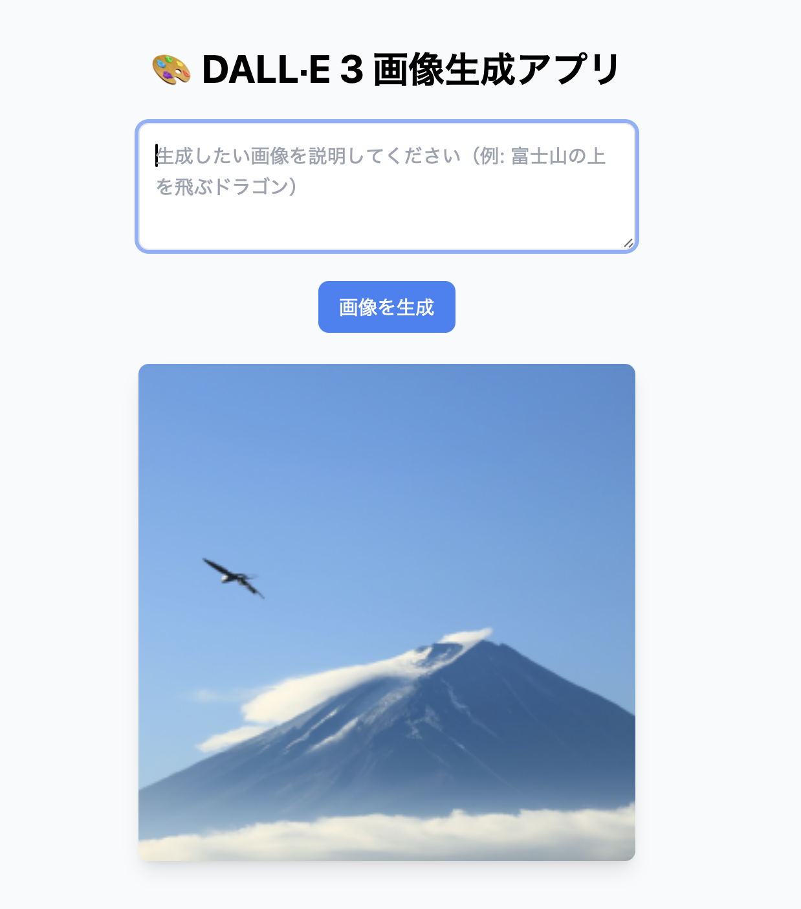

# 🎨 DALLE3APP

FastAPI + OpenAI API（DALL·E 3） + Vite + React + Tailwind CSS を使った画像生成アプリケーションです。  
テキストから画像を自動生成できます。  
AWSのEC2内にてデプロイ完了！（2025/11/8〜：現在公開停止中）



---

## 🚀 機能概要

- OpenAI DALL·E 3 API を利用した画像生成
- FastAPI によるバックエンド API サーバー
- React + Vite + Tailwind CSS によるフロントエンド
- CORS 対応済み（フロントエンドとバックエンドの通信を許可）
- Docker / 仮想環境対応（開発環境を簡単に再現可能）

---

## 📂 ディレクトリ構成
<pre>
DALLE3APP/
├── backend/ # FastAPI バックエンド
│ ├── main.py # メインAPIサーバー
│ ├── requirements.txt # バックエンド依存ライブラリ
│ └── ...
├── frontend/ # React フロントエンド
│ ├── index.html
│ ├── package.json
│ ├── tailwind.config.js
│ ├── postcss.config.js
│ └── src/
│ ├── App.jsx
│ ├── main.jsx
│ └── index.css
└── README.md
</pre>

---

## 🧰 環境構築

クローンして環境構築する手順は以下の通りです。  
オプションとしてDocker-composeでの構築も用意しています。（おすすめ！）

### 🔹 1. クローン
```bash
git clone https://github.com/minaR0404/DALLE3APP.git
cd DALLE3APP
```  

### 🔹 2. OpenAI API キーの設定
.env ファイル、または環境変数に以下を設定します：
```bash
export OPENAI_API_KEY="your_api_key_here"
```

### 🔹 3. バックエンド環境構築（FastAPI）
Python 仮想環境を構築して依存関係をインストールします。
```bash
cd backend
python3 -m venv venv
source venv/bin/activate
pip install -r requirements.txt
```
サーバー起動
```bash
uvicorn main:app --reload
```
API ドキュメントは以下で確認できます（実行前は確認できません）  
👉 [http://127.0.0.1:8000/docs](http://127.0.0.1:8000/docs)  

### 🔹 4. フロントエンド環境構築（Vite + React + Tailwind）
```bash
cd ../frontend
npm install
npm run dev
```
起動後、以下のURLにアクセスします  
👉 [http://localhost:5173/](http://localhost:5173/)  

### ⚙️ APIエンドポイント
| メソッド | エンドポイント | 概要 |
| ------ | ----------- | -------- |
|POST | /generate_image | テキストから画像を生成 |  

### 🐳 Docker での実行（おすすめ／オプション）
Docker 環境で簡単に起動できます。
```bash
docker compose up --build
```

---

## 🧠 使用技術
| 分類 | 使用技術 |
|------|-----------|
| フロントエンド | React / Vite / Tailwind CSS |
| バックエンド | FastAPI |
| 画像生成API | OpenAI DALL-E3 |
| 環境構築 | Python venv / Node.js / Docker（任意） |

---

## 🧑‍💻 著者情報

| 項目 | 内容 |
|------|------|
| **Author** | minaR0404 |
| **GitHub** | [https://github.com/minaR0404](https://github.com/minaR0404) |

## 📜 ライセンス

**MIT License**  
© 2025 minaR0404